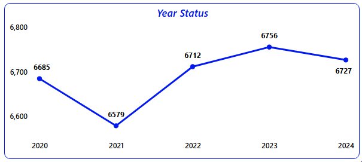
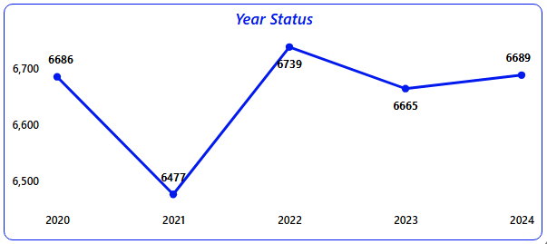
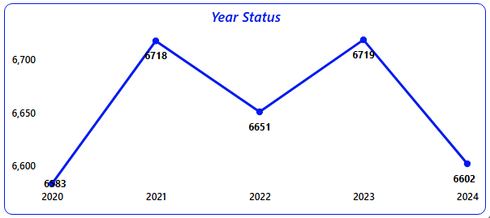

# 2000-2024_Happiest_Minds_Technologys_Employee_Analysis_HR_Dashboard_Using_Power-BI
## 🌐 Live Dashboard

- Click Here to View Live Dashboard: [https://app.powerbi.com/view?r=eyJrIjoiYjZiYWVmZDctM2IyMi00NDhiLTgzZTktMTc4Yzg5MjdjZjJkIiwidCI6IjhjZmNiNGI1LTQ3N2YtNDE3Zi1iMjRiLTE0MjZhODBjMWQ2MCJ9]

---

## 📌 Project Overview
- Tool Used: *Microsoft Power BI*
- Domain: *IT Employee Details Analysis*
- Duration: *4 Days*
- Objective: *To analyse the employee details and its salary details of Happiest Minds Technology’s across Locations.*
  - Chennai Analysis
  - Bangalore Analysis
  - Hyderabad Analysis

---

## 🌆 Dashboard Images

### Employee Details Screen

### Employee Count Analysis Screen

### Sum of Salary Analysis Screen

---

## 🏙️ Chennai Analysis

### 📊 Analysis

- YEAR: 2020
  - Head Counts – 6685, Joining Counts – 1379, Attrition Counts – 11, Salary Spent – 14.90 Bn, Average Salary – 2.23 M.
- YEAR: 2021
  - Head Counts – 6579, Joining Counts – 1316, Attrition Counts – 120, Salary Spent – 14.31 Bn, Average Salary – 2.18 M.
- YEAR: 2022
  - Head Counts – 6712, Joining Counts – 1377, Attrition Counts – 198, Salary Spent – 14.68 Bn, Average Salary – 2.19 M.
- YEAR: 2023
  - Head Counts – 6756, Joining Counts – 1399, Attrition Counts – 335, Salary Spent – 14.63 Bn, Average Salary – 2.17 M.
- YEAR: 2024
  - Head Counts – 6727, Joining Counts – 1362, Attrition Counts – 1326, Salary Spent – 14.72 Bn, Average Salary – 2.19 M.

### 🎯 Conclusion
- Year 2023 has a High Head Counts and Joining Counts. Compare to the Rest all 5 years 2023 has minimum Average Salary.
- Compare to the Rest all 5 years 2024 has the highest Attrition Counts, difference is 75.3%. Its highly considerable risk factor to the company.
- Year 2020 has the Highest Salary spent amount to the Employee. Rest all years are more similar Salary spent.
- All Years are almost Same of Average Salary, not any big difference.

---

## 🏙️ Bangalore Analysis

### 📊 Analysis

- YEAR: 2020
  - Head Counts – 6686, Joining Counts – 1325, Attrition Counts – 15, Salary Spent – 14.81 Bn, Average Salary – 2.21 M.
- YEAR: 2021
  - Head Counts – 6477, Joining Counts – 1316, Attrition Counts – 100, Salary Spent – 14.29 Bn, Average Salary – 2.21 M.
- YEAR: 2022
  - Head Counts – 6739, Joining Counts – 1343, Attrition Counts – 237, Salary Spent – 14.75 Bn, Average Salary – 2.19 M.
- YEAR: 2023
  - Head Counts – 6665, Joining Counts – 1399, Attrition Counts – 354, Salary Spent – 14.58 Bn, Average Salary – 2.19 M.
- YEAR: 2024
  - Head Counts – 6689, Joining Counts – 1327, Attrition Counts – 1332, Salary Spent – 14.62 Bn, Average Salary – 2.19 M.

### 🎯 Conclusion
- Year 2022 has a Higher Head Counts and Joining Counts. All the counts are more similar to previous years not the big differences.
- Year on Year Attrition count are increasing more than 75%, its shows big problem in upcoming years.
- All the years Employee Salary Spent are more similar, not big impact in salary spending (Head counts also shows the same result). Year 2020 is highest salary spending year.
- Year 2020 & 2021 are the Highest Average salary Spent Years.  

---

## 🏙️ Hyderabad Analysis

### 📊 Analysis

- YEAR: 2020
  - Head Counts – 6583, Joining Counts – 1290, Attrition Counts – 14, Salary Spent – 14.26 Bn, Average Salary – 2.17 M.
- YEAR: 2021
  - Head Counts – 6718, Joining Counts – 1314, Attrition Counts – 115, Salary Spent – 14.41 Bn, Average Salary – 2.14 M.
- YEAR: 2022
  - Head Counts – 6651, Joining Counts – 1326, Attrition Counts – 238, Salary Spent – 14.30 Bn, Average Salary – 2.15 M.
- YEAR: 2023
  - Head Counts – 6719, Joining Counts – 1256, Attrition Counts – 323, Salary Spent – 14.86 Bn, Average Salary – 2.21 M.
- YEAR: 2024
  - Head Counts – 6602, Joining Counts – 1311, Attrition Counts – 1300, Salary Spent – 14.49 Bn, Average Salary – 2.19 M.

### 🎯 Conclusion
- All the years Head Counts are been in the range of 6500 to 6700. Its shows more Consistent Employees are available in the office.
- All the years Joining Counts are also being consistent, the differences are less than 3%.
- Year on Year Attrition count are increasing, Especially Year 2024 has a 1300 Attrition count, compare to previous year 295 % higher.
- All the years Employee Salary Spent are more similar, not big impact in salary spending (Head counts also shows the same result). Year 2023 is highest salary spending year.
- Year on Year more flucation is happening in the Average Salary Spent.  
