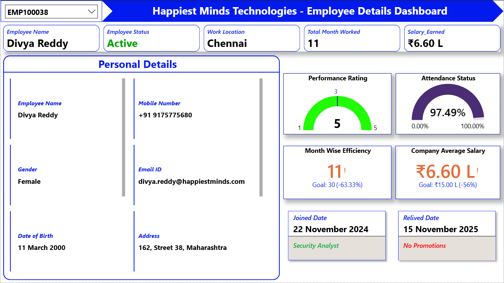
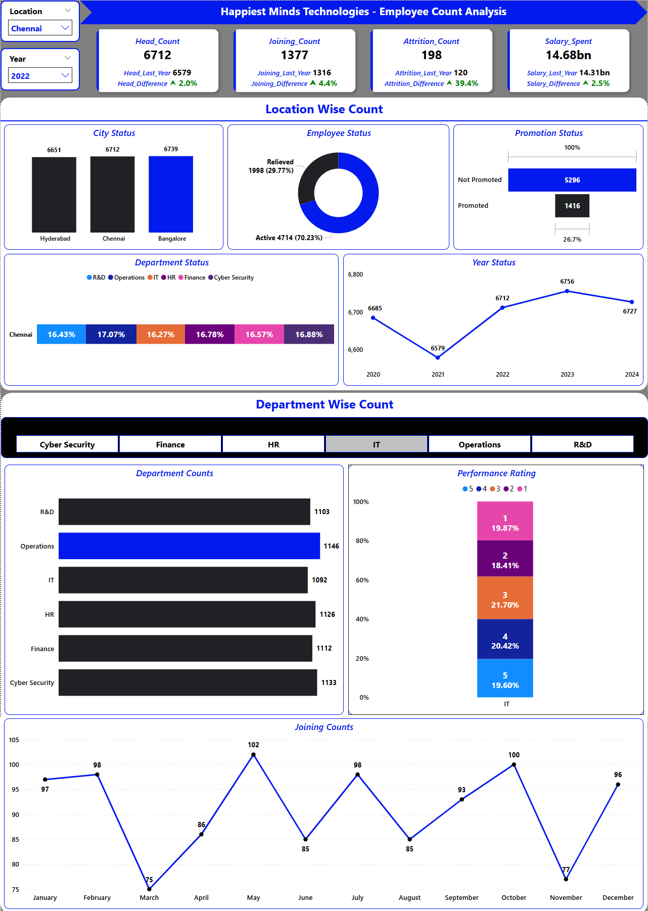
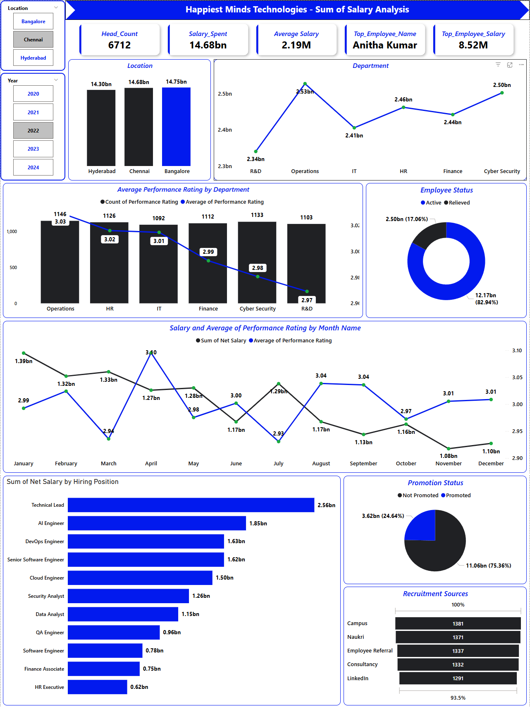

# 2000-2024_Happiest_Minds_Technologys_Employee_Analysis_HR_Dashboard_Using_Power-BI
## 🌐 Live Dashboard

- Click Here to View Live Dashboard: [https://app.powerbi.com/view?r=eyJrIjoiYjZiYWVmZDctM2IyMi00NDhiLTgzZTktMTc4Yzg5MjdjZjJkIiwidCI6IjhjZmNiNGI1LTQ3N2YtNDE3Zi1iMjRiLTE0MjZhODBjMWQ2MCJ9]

---

## 📌 Project Overview
- Tool Used: *Microsoft Power BI*
- Domain: *IT Employee Details Analysis*
- Duration: *4 Days*
- Objective: *To analyse the employee details and its salary details of Happiest Minds Technology’s across Locations.*
  - Chennai Analysis
  - Bangalore Analysis
  - Hyderabad Analysis

---

## 🌆 Dashboard Images

### Employee Details Screen

### Employee Count Analysis Screen

### Sum of Salary Analysis Screen

---

## 🏙️ Chennai Analysis

